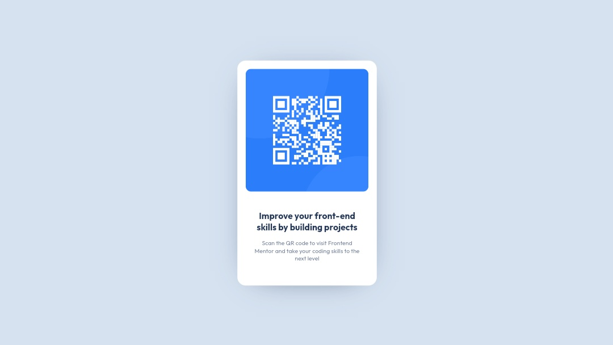

# Frontend Mentor - QR code component solution

This is a solution to the [QR code component challenge on Frontend Mentor](https://www.frontendmentor.io/challenges/qr-code-component-iux_sIO_H). Frontend Mentor challenges help you improve your coding skills by building realistic projects. 

## Table of contents

- [Overview](#overview)
  - [Screenshot](#screenshot)
  - [Links](#links)
- [My process](#my-process)
  - [Built with](#built-with)
- [Author](#author)

## Overview

### Screenshot




### Links

- Solution URL: [https://www.frontendmentor.io/solutions/responsive-qr-code-page-using-css-e3XOPh0Jhk](https://www.frontendmentor.io/solutions/responsive-qr-code-page-using-css-e3XOPh0Jhk)
- Live Site URL: [https://iwanharyatno.github.io/fm-qr-code](https://iwanharyatno.github.io/fm-qr-code)

## My process

### Built with

- CSS custom properties
- Mobile-first workflow

### What I learned

After doing this project, I've learned on how to center a varying height container both vertically and horizontally.

Below is the css code snippet on how I implement the technique using css transform.

```css
.center {
  position: absolute;
  top: 50%;
  left: 50%;
  transform: translate(-50%, -50%);
}
```

First I set the position of the element to `absolute`, and then move the element 50% of the viewport height away from the top and 50% of the width away from the left. Finally I translate the element about 50% of its width to the left (the first -50%), and about 50% of its height to the top (the second -50%).

And I have an assumption that I couldn't center a container vertically using flexbox if the container's height is not fixed.

## Author

- Website - [Iwan Haryatno](https://iwanharyatno.github.io)
- Frontend Mentor - [@iwanharyatno](https://www.frontendmentor.io/profile/iwanharyatno)
